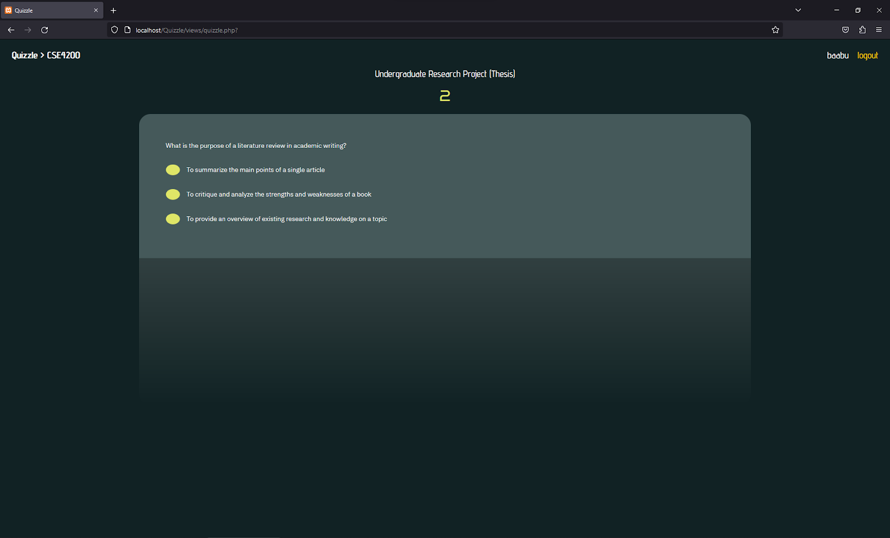

# QUIZZLE 
This is a quizzing app made as an implementation of a peer-learning model designed for my thesis

## FEATURES
- multiple users
- custom authentication
- a quiz bank with user-added questions and answers
- a commenting system
- a voting system
- statistics regarding player scores/comments/contributions
- leaderboard

## HOW DO I GET THIS UP AND RUNNING?
- quizzle was made using HTML, CSS, Javascript, and PHP
- download XAMPP or WAMP
- (if XAMPP) - go to xampp folder -> htdocs folder, then put the quizzle folder 
- go to phpMyAdmin, import quizzle sql file
- create user in phpMyAdmin with username="admin" and password=""
- run XAMPP in administrator
- start Apache and MySQL
- Go to http://localhost/Quizzle/views/index.php

## SCREENSHOTS

### Login

### Signup

### Homepage

### Course Selected

### Investing Quiz

### Quizzle

### Quizzle (Answered)
.png)
